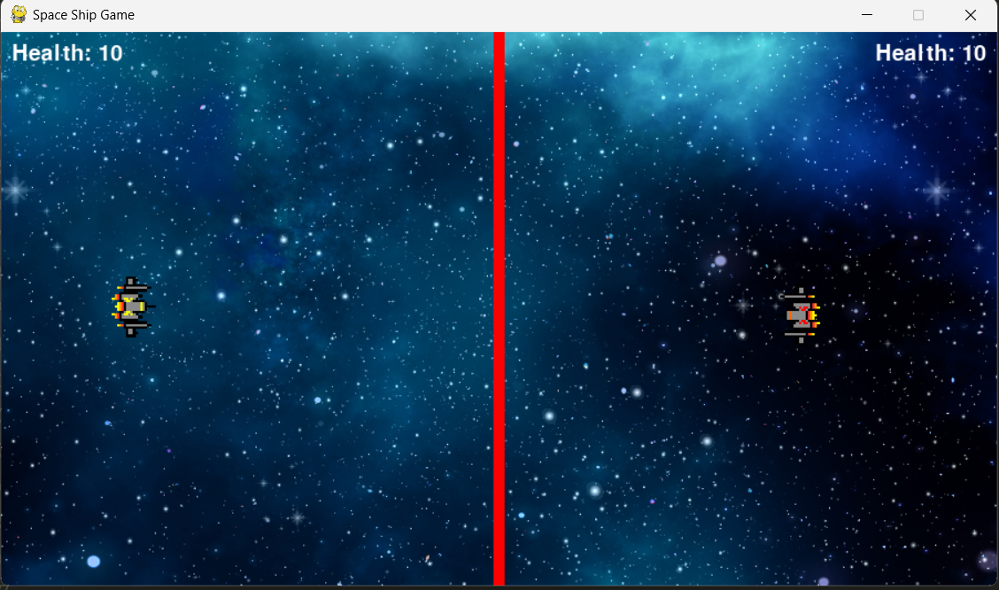
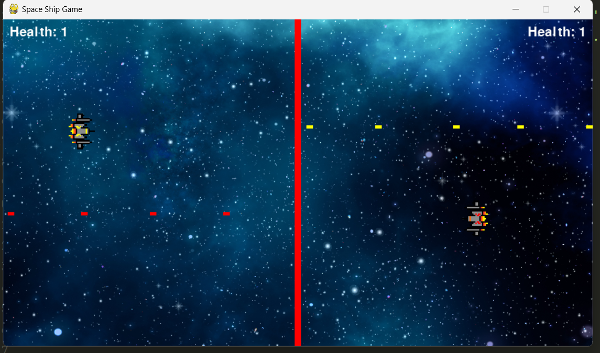
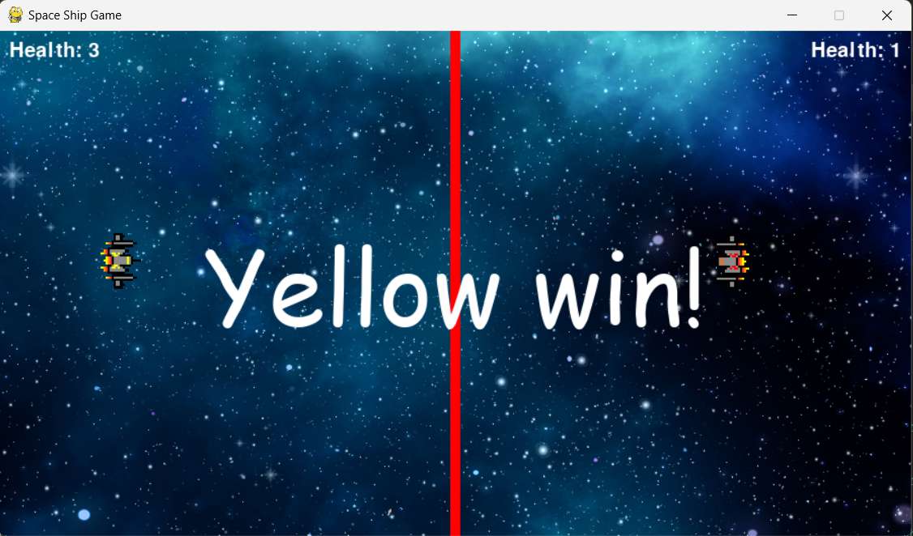

# Spaceship Fighter Game

A 2D multiplayer spaceship game built using **Pygame** where two players control spaceships and battle each other by shooting bullets.

## Game Overview

- Two spaceships: Red and Yellow.
- Players control the movement of their spaceship and fire bullets to hit the opponent.
- The game ends when one player's health reaches zero, and the other player is declared the winner.
  
## Controls

### Yellow Spaceship:
- **Move Up**: `W`
- **Move Down**: `S`
- **Move Left**: `A`
- **Move Right**: `D`
- **Shoot**: `Left Ctrl`

### Red Spaceship:
- **Move Up**: `Arrow Up`
- **Move Down**: `Arrow Down`
- **Move Left**: `Arrow Left`
- **Move Right**: `Arrow Right`
- **Shoot**: `Right Ctrl`

## How to Play

1. Start the game, and each player takes control of their spaceship (Yellow or Red).
2. Move around the screen and try to avoid the border in the middle.
3. Fire bullets at your opponent. Each player can have up to 6 bullets on the screen at a time.
4. When a bullet hits the opponent, they lose health.
5. The game ends when one player's health reaches zero, and a winning message is displayed.

## Features

- **Multiplayer**: Two players can play on the same machine.
- **Health Tracking**: Health is displayed for both players on the screen.
- **Sound Effects**: Shooting and bullet impact sounds.
- **Background and Spaceships**: Custom background and spaceship images.

## Screenshots

  ### In-Game Action
  

  ### In-Game Battle
  

  ### In-Game Winning
  

